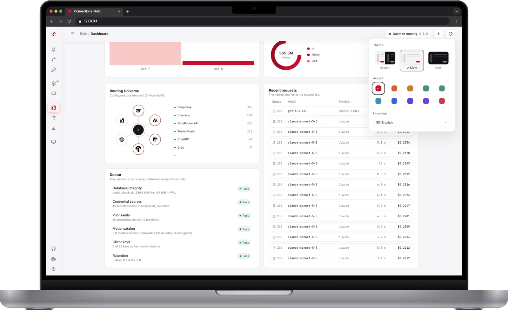
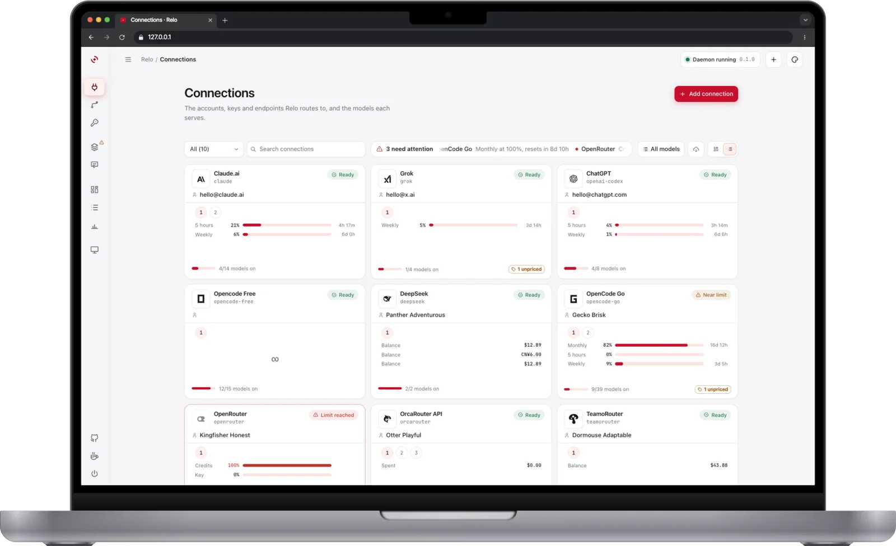
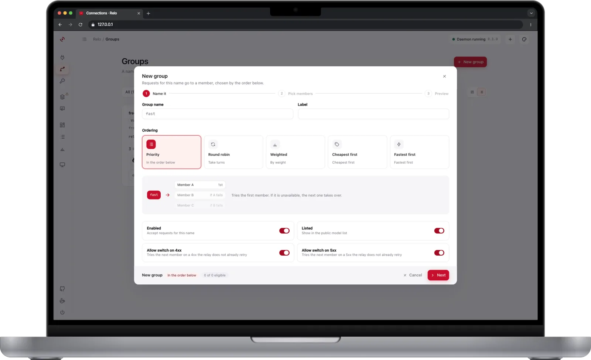
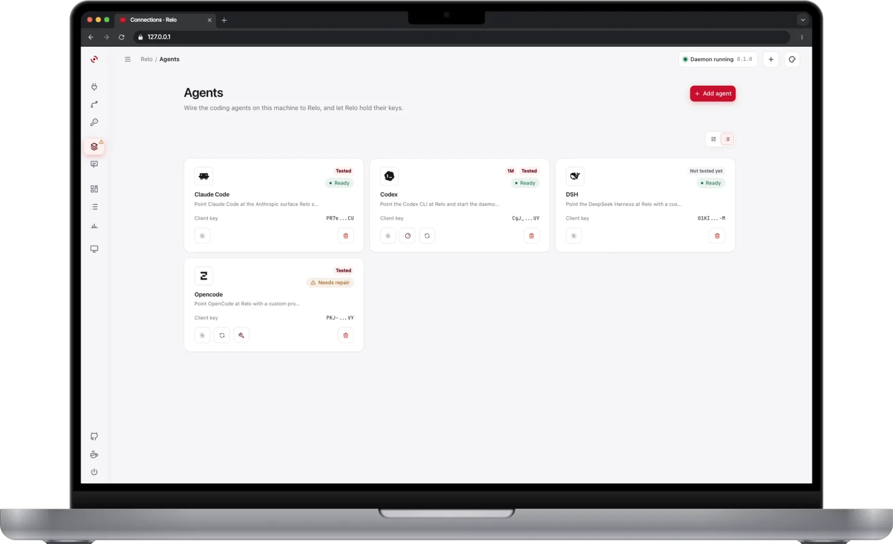
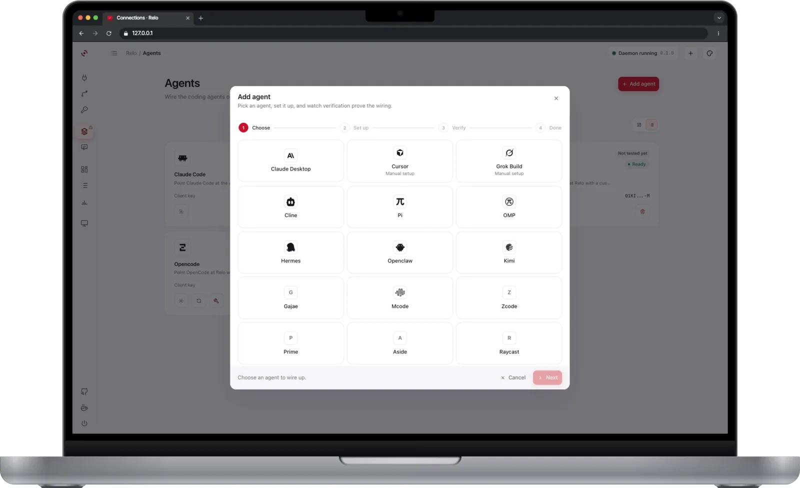
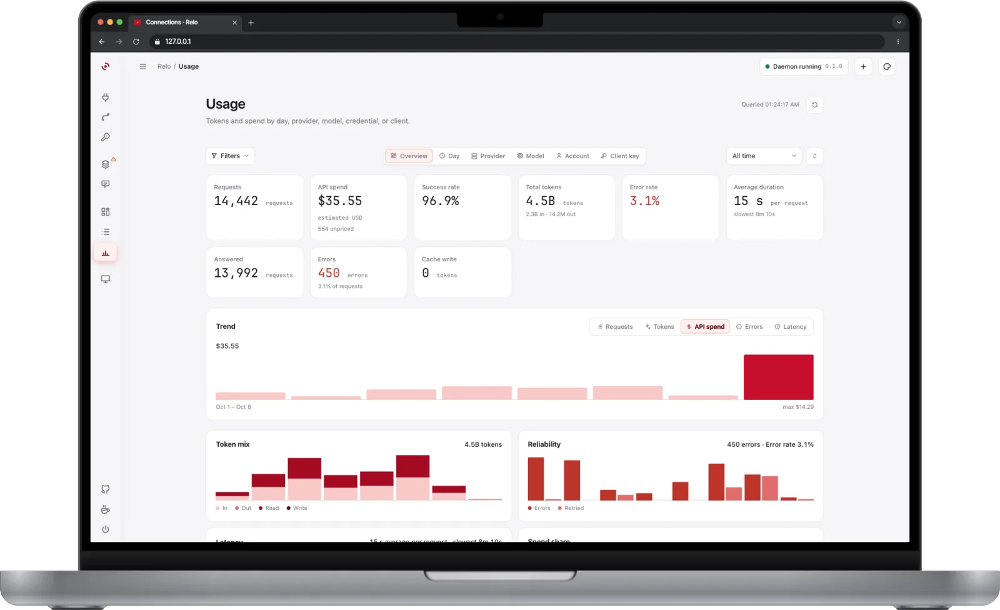
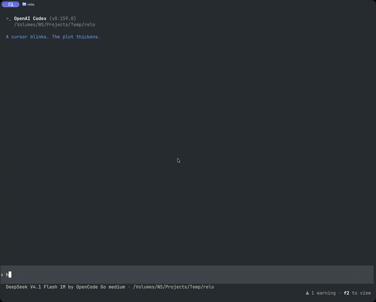

<div align="center">


<h2>Relo</h2>

<code>▚▚▚▚▚▚▚ Light • Fast • Reliable ▚▚▚▚▚▚▚</code>

</div>

> One local proxy that lets Codex, Claude Code, Cursor and Grok, etc talk to any model, with no config changes.

## ▓ CONSOLE

|                                                                       |                                                                        |                                                                     |
|-----------------------------------------------------------------------|------------------------------------------------------------------------|---------------------------------------------------------------------|
| Dashboard                                                             | Connections                                                            | Groups                                                              |
|  |  |     |
| Agents                                                                | Add agent                                                              | Usage                                                               |
|  |     |  |

<div align="center">

<br>
<sub>Demo: using Relo in Codex</sub>
</div>

## ▓ INSTALL

Relo has not been released yet, so there is nothing to install. Please wait for the first release.

## ▓ START

```console
$ relo daemon start                 # console at http://127.0.0.1:10101
```

`daemon start` runs the proxy in the background and shows the tray icon when a desktop session is available.
`daemon run` keeps the same process in the foreground, which is what a terminal, a login item, and Relo.app use.

Loopback only. `[admin] login = true` puts a sign-in in front, using `$RELO_HOME/admin-token`.

## ▓ SURFACES

| Port    | Speaks                      |
|---------|-----------------------------|
| `10101` | console + management API    |
| `10201` | OpenAI-compatible (`/v1/*`) |
| `10202` | Anthropic (`/v1/*`)         |

Client keys hit the data plane. The admin token hits the console. Provider credentials go upstream only.

## ▓ COMMANDS

```console
$ relo daemon run|start|stop|restart|status
$ relo autostart enable|disable
$ relo uninstall [--keep-data|--wipe]
$ relo version
```

`--home` and `--lang` override one run. Everything else (connections, keys, routes) is a console page.

`daemon stop --force` stops the daemon and frees the ports Relo serves, which is what an installer runs before it
replaces the binaries. A port another program holds is reported rather than ended.

## ▓ UNINSTALL

```console
$ relo uninstall            # asks whether the data goes, then removes the program
$ relo uninstall --keep-data # stops Relo, unregisters the login items, keeps the data
$ relo uninstall --wipe      # the same, and deletes $RELO_HOME and its keychain entries
```

`relo uninstall` stops the running daemon, frees every configured port, turns off start-at-login, settles the data,
and hands the program to whatever installed it: the Windows uninstaller, `apt`/`dnf` on Linux, `npm uninstall -g` on
npm, or deleting `Relo.app` on macOS. What each native path keeps:

| Path                     | Data                                   |
|--------------------------|----------------------------------------|
| `relo uninstall`         | asks; `y` deletes, anything else keeps |
| Windows: Settings → Apps | asks in a dialog; No keeps             |
| `apt remove relo`        | keeps (`apt purge relo` deletes)       |
| `rpm -e relo`            | keeps                                  |
| `npm uninstall -g relo`  | keeps                                  |

An update or reinstall always keeps the data and stops the running service first, so nothing is lost by installing
over a working install.

## ▓ CONFIG

`$RELO_HOME` (`~/.relo`) is the only env var. Settings live in `config.toml`. See [
`config.example.toml`](config.example.toml).

Secrets sit in `$RELO_HOME/secrets.enc`, sealed by `$RELO_HOME/secret.key`. `[secrets] keychain = true` uses the OS
keychain instead.

## ▓ DEV

```console
$ make build          # console + daemon → ./relo
$ make dev-setup      # writes .dev/relo, leaves ~/.relo alone
$ make ci
```

Go 1.26+, Node 20+. No CGO. See [CONTRIBUTING.md](CONTRIBUTING.md) and [docs/](docs/README.md) for the
rest, [SECURITY.md](SECURITY.md) to report a vulnerability, and [THIRD_PARTY_NOTICES.md](THIRD_PARTY_NOTICES.md) for
bundled licenses.

## ▓ LICENSE

Relo is licensed under the [GNU Affero General Public License v3.0](LICENSE). Bundled third-party software keeps its own
licenses; see [THIRD_PARTY_NOTICES.md](THIRD_PARTY_NOTICES.md).
